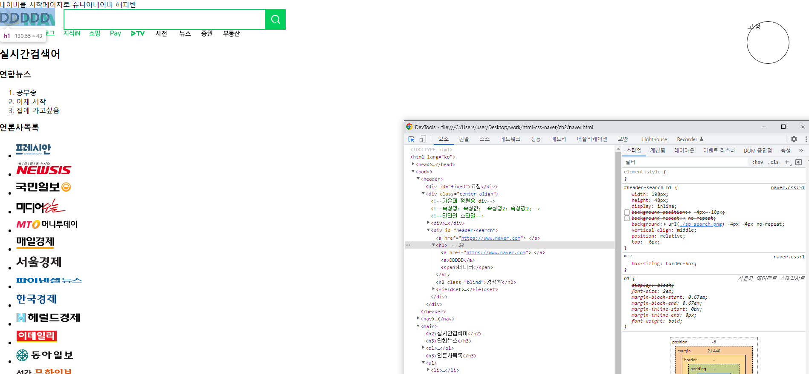

# HTML태그들

## SEMANTIC TAGS

* SEO
* Accessibility&#x20;
* For us, Maintainability

## div-> semantic tags&#x20;

div태그를 남발하는 경우보다는 semantic tags 를 이용한

.png>)\
출처:youtube 드림코딩&#x20;

* header: 브랜드 로고, 중요한메뉴
* nav : header안에 여러 메뉴들은 nav태그사용
* footer:웹사이트 하단에 부가적인내용 링크는 footer
* main: 웹사이트 중요한컨텐츠 main
* aside:페이지 컨텐츠와 상관없는 광고나 다른링크
* article,section: 메인안에 중요한내용들 나눌때&#x20;

### article

* 메인안에 자체만으로 독립적으로 보여줄때

### section

* articl 안이나 메인안이나 연관된 내용 묶을

### i태그와 em태그 차이

* i 태그는 시각적으로만 이탤릭체 (책의 제목 인용구 시각적으로만 표현할때)
* em 태그는 강조하는 이탤릭(정말 강조하고싶은문)

### b태그와 strong 태그 차이

* b는 시각적으로만 강조 볼드
* strong 정말 중요한 볼드체

### ol ,ul,dl 태그 차이점

* ul : 순서가 필요없는&#x20;
* ol : 순서가 중요할때,
* dl : 어떤 단어에대해 설명이 묶여있을때 ??? 내일다 dt dd 한문장 정의 설명목

### img태그와 background-image(css) 차

* img이미지가 웹페이지안에 하나의 중요한 자리를 잡고있을때
* img태그가 문서의 내용과 다르게 배경이미지,  문서의 일부가 아닌경우 background-image 사

### button태그와 a태그 차이

* button:사용자의 특정한 액션은
* a:어디론가 이동할때 (링크)

### table태그,css차이

* table:행 +열 데이터가 필요할때만  단순히 그리드형식일경우는 css(flex,grid)를이용한다&#x20;
* 자체적으로 문서안에 의미가 필요한지 효과를 주기 위한건지 판단하자

