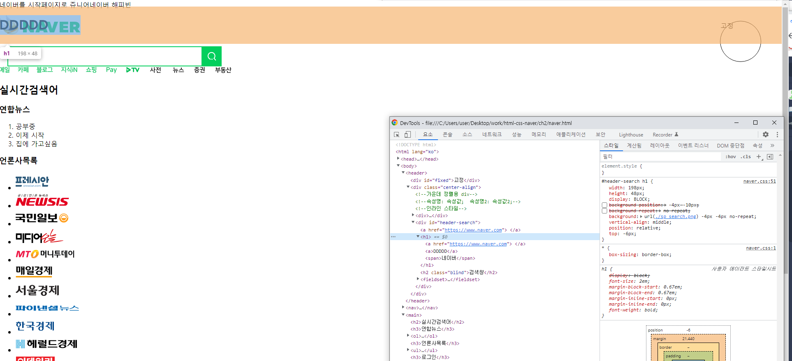
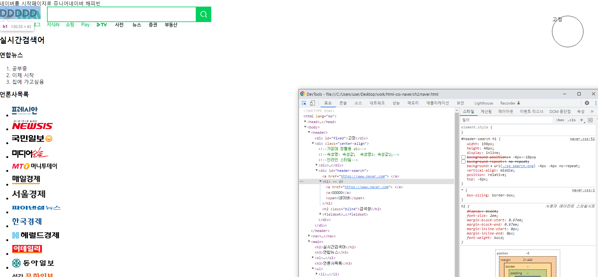
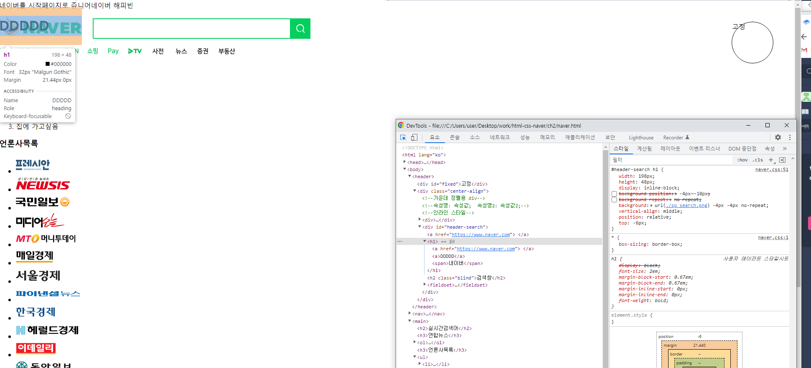

# 픽셀과 자식/자손선택자.display

## css 픽셀 정하기

```html
<header>
  <div id="fixed">고정</div>
  <div class="center-align">
    <!--가운데 정렬용 div-->
    <!--속성명: 속성값;  속성명2: 속성값2;-->
    <!--인라인 스타일-->
    <div>
      <span>네이버를 시작페이지로</span>
      <span>쥬니어네이버</span>
      <span>해피빈</span>
    </div>
    <div id="header-search">
      <a href="https://www.naver.com">
        <h1>
          <span>네이버</span>
        </h1>
      </a>
      <h2 class="blind">검색창</h2>
      <fieldset>
        <legend class="blind">검색</legend>
        <input />
        <button>
          <span class="blind">검색</span>
          <span id="search-image"></span>
        </button>
      </fieldset>
    </div>
  </div>
</header>
```

```css
#header-search h1 {
  width: 198px;
  height: 48px;
  display: inline-block;
  /*background-image: url(./sp_search.png);U*/
  /*background-position: -4px -10px;*/
  /*background-repeat: no-repeat;*/
  background: url(./sp_search.png) -4px -4px no-repeat;
  vertical-align: middle;
  position: relative;
  top: -6px;
}

#header-search h1 span {
  display: none;
}

#header-search h2 {
  display: none;
}
```

- div 태그에는 id를 붙여준다
- css파일에 들어가 #hader-search h1 자손인 h1을 선택해준다
- width 넓이 height 높이

## display, inline-block,inline,block 차이



### block

- height와 width 값 적용 O
- margin과 padding 을 적용 O

## lnline



width,height 적용 X

margin,padding 적용X

### inline-block



- width,height 값 적용O
- margin, padding-top,padding-bottom 적용 O
- inline-height 적용 O
