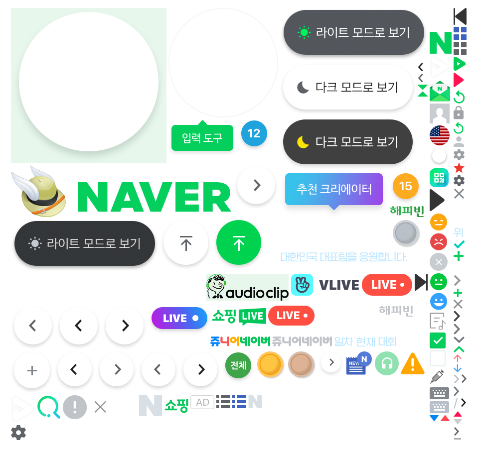

# 클래스 이미지 스프라이트

## <mark style="color:blue;">blind</mark>

**display: none;** 할 경우 스크린 리더에 읽히지 않는다. 웹접근성이 떨어\
<mark style="color:blue;">**blind class**</mark> 를 사용하면 화면에는 보이지 않고 스크린 리더에는 읽힌다.

```html
<h2 class="blind hiro"></h2>
```

## <mark style="color:yellow;">id</mark>와 <mark style="color:blue;">class</mark>의 차이점

- <mark style="color:yellow;">**id**</mark> 는 고유한거 , 딱 한번만 쓸수있다.

```html
<div id="header-search"></div>
```

- <mark style="color:blue;">**class**</mark>는 원하는 거 어디든 넣을 수 있다 하나의 태그에도 여러 개의 class 사용가능하다.

```html
<div class="blind hiro babo"></div>
```

## 이미지 스프라이트



- 관련 이미지들을 묶어서 한번에 요청 하는 것 .
- 서버에 부담을 줄여준.
