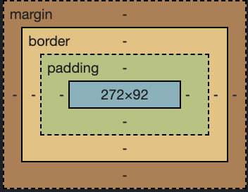

# 백그라운드와 박스 모델

## background-image, background-position

```css
#header-search > h1 {
  width: 198px;
  height: 48 px;
  display: inline-block;
  /*background-image: url(./sp_search.png);U*/
  /*background-position: -4px -10px;*/
  /*background-repeat: no-repeat;*/
  background: url(./sp_search.png) -4px -4px no-repeat;
}
```

### background-image: 이미지를 배경으로 사용할 때

- none: 이미지를 배경으로 사용하지 않음
- url: 이미지의 url 입력
- initial: 기본값
- inherit: 부모 요소의 속성 값 상속 받는다
- background-image 할때는 width,height 잘해줘야함 (특히 이미지 스프라이트 할 경우)

### backgroud-position: 배경 이미지의 위치

### background-repeat: 이미지를 가로 세로 방향으로 반복할 때

- repeat: 이미지가 가로,세로 방향으로 반복된다
- repeat-x: 가로 방향 반복
- repeat-y: 세로 방향 반복
- no-repeat: 반복하지 않는다.
- inherit: 부모 요소의 속성 값을 물려 받는다.

# box model



HTML 요소는 box로 이루어져 있습니다. 박스 위에 박스를 얹거나 박스들을 배열하여 문서를 만들어 나갑니다. 구성은 아래의 4가지로 이루어져 있습니다.

- content: 컨텐츠
- margin: 바깥 여백
- boder: 테두리
- padding:안쪽 여백
