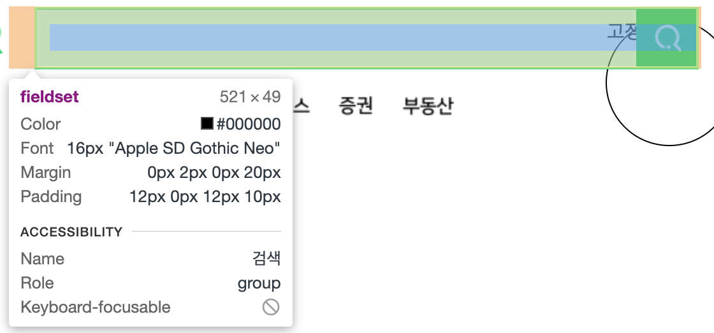

# box-sizing

```css
#header-search fieldset {
  margin-left: 20px;
  padding: 12px 0 12px 10px;
  width: 521px;
  height: 49px;
  display: inline-block;
  border: 2px solid #03cf5d; /* 구글 hex color 검색*/
  vertical-align: middle;
  position: relative;
}
```

  

- box sizing CSS 속성은 요소의 너비와 높이를 계산하는 방법을 지정합니다.

- box-sizing: content box; 는 content의 너비와 높이만
- box-sizing: boder box는; boder 까지 포함한 값
